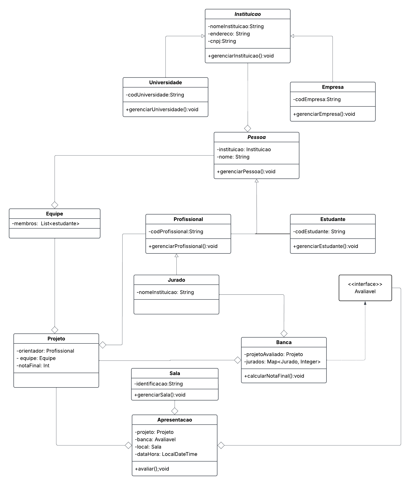

## Contexto do Projeto

Você foi convidado para participar do desenvolvimento de um sistema para gerenciar um **Hackathon Universitário**, promovido anualmente por diversas universidades. O sistema tem como principal objetivo facilitar o gerenciamento dos **Projetos** e **Equipes** participantes, além de controlar apresentações, bancas avaliadoras e notas.

O sistema foi modelado a partir de um diagrama UML, sendo necessário definir atributos e métodos para cada classe envolvida. Toda a gestão dos dados ocorre em memória principal, utilizando classes auxiliares para controlar as coleções de objetos, como equipes, projetos e apresentações. Essas classes seguem o padrão de projeto Singleton, garantindo que apenas uma instância de cada coleção seja utilizada durante a execução do sistema.

As classes de coleção oferecem métodos para incluir e pesquisar elementos, tornando o gerenciamento eficiente e seguro.

## Principais Funcionalidades

- Cadastro e gerenciamento de equipes e projetos;
- Controle de apresentações e bancas avaliadoras;
- Avaliação dos projetos pelos jurados;
- Listagem dos projetos aprovados (nota final ≥ 7).

## Exemplo de Uso

No método `main`, o sistema realiza as seguintes operações:

- Cria 2 equipes com 5 alunos cada;
- Adiciona um projeto diferente para cada equipe;
- Cria uma banca avaliadora para cada projeto (cada banca contém 4 jurados);
- Calcula a nota final de cada projeto a partir da apresentação (média das notas dos jurados);
- Lista os projetos com nota final ≥ 7 utilizando stream.

## Diagrama UML

O diagrama UML abaixo representa a estrutura inicial do sistema, servindo como base para a modelagem das classes e suas relações.



## Como Executar

Para compilar e executar o projeto, utilize os comandos abaixo no terminal:

```sh
cd "c:\Users\maria\OneDrive\Documentos\Projeto Pm\Hackathons\src"
javac controller\ProjetoController.java Main.java
java Main
```